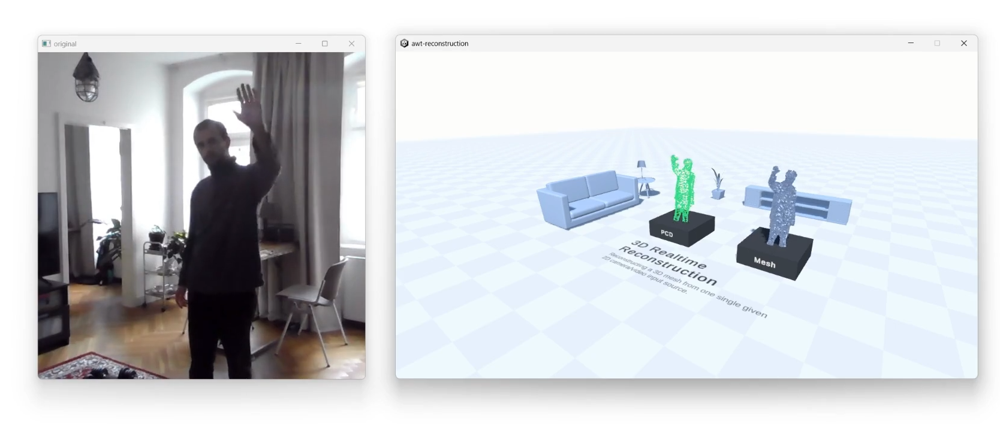
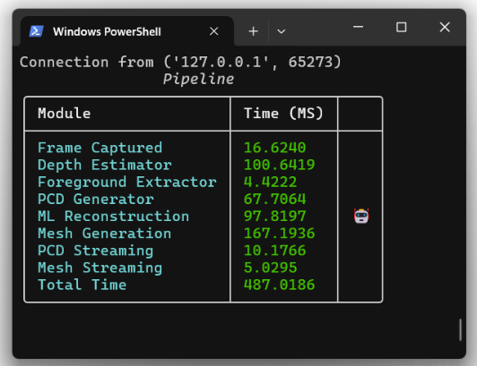
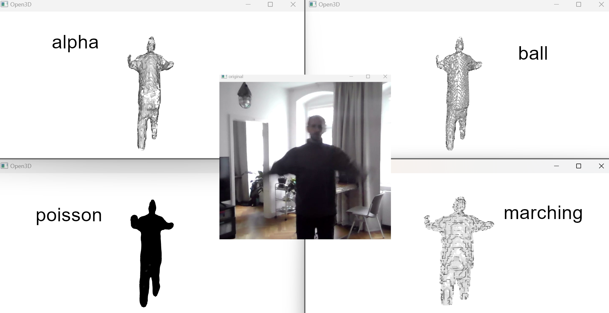

# Realtime 3D Human Mesh Reconstruction from a single 2D Camera View
This repository contains elements created as a part of the AWT project seminar.
With this work, we want to reconstruct a 3D human mesh in realtime from a singe 2D camera view.


Just to clarify the repository structure, here are some relevant subdirectories:
* Python Project
  * models
  * pipeline
  * vendor
* Unity project
  * unity-project _for result streaming/visualization_
* Data 
  * recordings _used as an alternative to a webcams tream_
* ...

Our main software is the python project which offers a fully modular pipeline.
The pipeline contains components which access models/ and vendor/. In **pipeline_starter.py**
the pipeline is put together. The pipeline can also stream the results to other environments like Unity.


## Setup
We use conda to create our environment

```
git clone ...
cd awt-pj-ws2425-3d-realtime-reconstruction
conda create --name <env> --file requirements.txt
```

We use the [Depth Anything V2 Model](https://github.com/DepthAnything/Depth-Anything-V2).
To run our code you have to clone their repository in our vendor directory.
```
cd vendor
git clone https://github.com/DepthAnything/Depth-Anything-V2.git
cd ..
```

After that you ready to launch the python software.
To do that you have to direct to the pipeline folder.
```
cd pipeline
python -m pipeline_starter
```

To visualize the point cloud and the mesh in Unity, 
you have to open the [**unity-project**](unity-project/awt-reconstruction/) in Unity.
> Note that we use Unity 2023

Navigate to the "sample scene".
starting the scene will automatically connect to the websockets started from the python
pipeline and the point cloud and the mesh will be updated.
Make sure to run python first to establish the connection.


## Usage
In the **pipeline_starter.py** You have some options to configure the pipeline.
With
```
cd pipeline
python -m pipeline_starter
```
When running the code our pipeline interface shows up visualizing each active module and it's frame processing time.



### Pipeline Options
In Pipeline Starter you can choose between high performance mode and weather to choose a presaved video as input or a live camera stram:
```
is_highperformance_mode = True  # Use RMBG Model or Fast Segmentation Thresholding
is_live_stream_mode = False  # Use live stream from webcam source or recording5.mp4
```

The python software visualizes in open3d.
You can also stream the point cloud and the mesh via websockets.
Each component is initialized in the pipeline and has different option parameters.
For example:
```
mesh_generator = MeshGenerator(visualize=True, approach='alpha')
```

Each module has a **visualize** param which decides
for each step if it should generate visual output directly in the pipeline.

With the **approach** parameter (only in MeshGenerator) you can decide which mesh generation approach is used.
In the Picture you can see the currently supported options.


> Note that in poisson the material is missing. When you stream to Unity it would also be gray.

Also the `depth_thresholder` module can be exchanged with the `foreground_extractor` module for a high quality
Foreground segmentation that is more robust and reliable but slow's the pipeline dramatically.